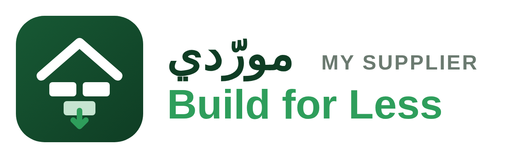

<p align="center"></p>

# مورّدي — My Supplier · **Build for Less**

> **رسالتنا:** أن يحصل كل من يبني في المملكة — مقاولاً كان أو مالك مشروع — على أفضل سعر لكل مادة بناء، بشفافية كاملة وبضغطة واحدة. كل ريال توفّره في المواد هو ريال يبني به أكثر.
> **Our mission:** everyone who builds in the Kingdom gets the best price on every material, transparently and in one click. *Build for Less.*

**منصة أسعار مواد البناء وطلبات التسعير في المملكة العربية السعودية.**
Building-materials price comparison, RFQ (request-for-quotation) and supplier-bidding platform — web, dashboard, and iOS/Android app.

| Layer | Stack | Folder |
|---|---|---|
| API + database | Python 3.12 · FastAPI · SQLAlchemy 2 · SQLite (dev) / PostgreSQL (prod) · JWT | [`backend/`](backend) |
| Website + buyer/supplier/admin dashboards | React 18 · TypeScript · Vite · Arabic RTL + English | [`web/`](web) |
| Mobile app (iOS + Android) | Expo SDK 53 · React Native · React Navigation | [`mobile/`](mobile) |
| Docs | Architecture, API, business model, roadmap | [`docs/`](docs) |

## What it does

**For anyone in construction (buyers)**
- Search any construction item and see **every supplier's price side by side** (registered suppliers + external reference sources), with best / average / median price, 90-day price history and 30-day change.
- Filter by city, brand, category; compare products; **price-drop alerts** (watchlist).
- **Buy directly** from a registered supplier's offer, or collect items into a **quote list → RFQ** with quantities.
- RFQ reaches matching registered suppliers instantly (category + city matching, or invite-only), suppliers bid, buyer sees **ranked bids with market reference**, awards with one click → order is created and tracked to delivery, then rated.

**For suppliers**
- Register, get verified by the platform, manage a **live price list** (per city, min qty, stock, VAT handling) or **bulk import CSV/JSON**.
- Receive **open RFQs** in their specialties, submit / update / withdraw bids, see win-rate, orders, pipeline and revenue on their dashboard.
- Confirm → deliver orders; collect ratings.

**Payments, OTP, notifications (v1.1)**
- **Escrow payments**: pay an order by mada / card / Apple Pay / STC Pay (Moyasar hosted page) or bank transfer; funds are held by the platform and released to the supplier after delivery, minus the platform fee. Payouts, refunds, ZATCA-style tax invoices with QR, platform-fee invoices, admin finance dashboard.
- **OTP**: SMS/WhatsApp/email one-time codes for registration, passwordless phone login, password reset and phone verification (Unifonic / Twilio / SMTP; console mode for dev).
- **Notifications**: every event goes to in-app + email + SMS + WhatsApp + Expo push according to the user's preferences, through an outbox with retries and an admin delivery log.
- **Background jobs**: RFQ expiry, price alerts, daily external feed fetching, payment expiry. Rate limiting, Alembic migrations.
- **v1.2**: logo/product-image/document uploads (local or S3), supplier compliance document review, Excel/CSV bill-of-quantities import into an RFQ with product matching, bid comparison export to Excel, order disputes with admin resolution and refund, Sentry hook.
- Details and env variables: [docs/INTEGRATIONS.md](docs/INTEGRATIONS.md).

**For the platform (admin dashboard)**
- KPIs: users, suppliers pending verification, products, offers, RFQs, bids, orders, GMV, estimated take-rate revenue, 30-day series.
- Supplier verification & plans (free / pro / enterprise), user management, category management.
- **External price sources**: CSV/JSON feeds by URL or manual upload → appear as reference prices in comparisons ("prices from all other suppliers/resources").
- Data-quality view: stale offers, outlier prices; audit log.

## Run locally

### 1. API
```bash
cd backend
python3 -m venv .venv && source .venv/bin/activate
pip install -r requirements.txt
uvicorn app.main:app --reload --port 8000
```
- API: http://localhost:8000/api/v1 · interactive docs: http://localhost:8000/docs
- First start creates the SQLite DB in `backend/data/`, the category tree, ~58 products, and (when `SEED_DEMO_DATA=1`, the default) 7 demo suppliers with prices and 90 days of history.

**Demo accounts** (password `Demo@2026` unless noted)

| Role | Email |
|---|---|
| Admin | `admin@mysupplier.sa` / `Admin@2026` |
| Buyer | `buyer@demo.sa` |
| Suppliers | `supplier1@demo.sa` … `supplier7@demo.sa` |

### 2. Website + dashboards
```bash
cd web
npm install
npm run dev        # http://localhost:5173 (proxies /api to :8000)
npm run build      # → web/dist — served automatically by the API at / when present
```

### 3. Mobile app
```bash
cd mobile
npm install --legacy-peer-deps
npx expo start     # scan the QR with Expo Go (iOS/Android); in dev it targets http://<your-host>:8000
```
Store builds: `eas build -p ios|android --profile production` (set `apiBase` in `app.json` / `EXPO_PUBLIC_API_BASE`).

### 4. Tests
```bash
cd backend && python -m pytest -q      # 17 end-to-end scenarios (auth, catalog, import, RFQ→bid→award→order→review, admin, payments, OTP, notifications, jobs)
cd web && npm run typecheck
cd mobile && npm run typecheck
```

## Deploy

**Production, step by step: [DEPLOYMENT.md](DEPLOYMENT.md)** (server + HTTPS, Moyasar, Unifonic, SMTP, app stores, go-live checklist).

Quick version: `cp .env.production.example .env`, fill it, then `docker compose -f docker-compose.prod.yml up -d --build` — Caddy gives you HTTPS, the API image builds the web app and serves it, migrations run on start. Dev: `docker compose up --build`. A GitHub Action publishes the image to GHCR on every push to `main`.

## Repository layout
```
backend/app/
  main.py            FastAPI app, routers, SPA hosting
  models.py          Users, suppliers, categories, products, offers, price history, sources,
                     RFQs, RFQ items, bids, orders, reviews, notifications, alerts, audit
  routers/           auth · catalog · market · suppliers · rfq · orders · notifications · admin
  services/          pricing · ingestion (CSV/JSON feeds) · matching · notify · channels (email/SMS/WhatsApp/push outbox)
                     payments (mock/Moyasar, escrow, payouts, invoices) · otp · jobs (scheduler)
backend/migrations/  Alembic migrations
  seed.py            Saudi building-materials catalog + demo data
backend/tests/       pytest end-to-end suite
web/src/             pages/ (public, buyer/, supplier/, admin/), components/, api.ts, i18n.tsx, auth.tsx
mobile/src/          screens/, store.tsx, api.ts, i18n.ts, theme.ts
docs/                ARCHITECTURE.md · API.md · BUSINESS_MODEL.md · ROADMAP.md
```
